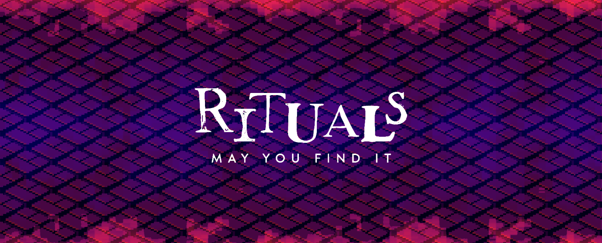

## ͼ Description ͽ  

In *Rituals*, you play as a human who breaks through the boundaries of the known universe and awakens in the **Librarius Transversarius IV** — a gateway library suspended between our world and limbo.  
Your goal: **find a way out** and **save reality itself** from the spreading influence of the **Thing**, a cosmic entity devouring the edges of existence.  

---

## ͼ How to Play ͽ  

There are several ways to play *Rituals*. You can start right here in your browser on this page, or play the [full-page version](https://rituals.ethan-folio.fr/) of the game.  

Alternatively, you can visit the [GitHub repository](https://github.com/methil-mods/rituals), clone it, and run the game in Unity.  
The source code is available there, and we’ll also publish official releases on that page.  

---

## ͼ Controls ͽ  

| Key | Action |
|-----|---------|
| **Click** | Move |
| **E** | Interact |
| **Mouse** | Draw on the summoning table |

---

## ͼ Screenshots ͽ

---

## ͼ Stuck in the Game ͽ  

**⚠️ Spoiler Warning ⚠️**

### Game Mechanics  

In *Rituals*, your goal is to discover which ritual to draw in order to summon an entity.  
You can access the ritual space in the bottom-left corner of the map.  
There, you’ll find a blank canvas to draw on. You can clear, finish, or quit the ritual at any time.  

- *Clear:* Erases your current drawing.  
- *Finish:* Uses our custom CNN to predict which entity your drawing represents, summoning it if a match exists.  
- *Quit:* Exits the ritual table without erasing your drawing.  

The game is structured around a room-based system. Once a room is unlocked, you can always return to it.  
To unlock new rooms, you must solve various enigmas. Currently, there are two types:  

- *Ritual:* Find which ritual to draw.  
- *Passkey:* Discover a code using clues hidden in books and from summoned entities.  

Interactive spots are marked with a red ritual symbol on the ground.  
When standing over one, press **E** to interact — you may open a book, access the ritual table, or trigger other effects.  
Be careful: some books are trapped and can send you into the **Limbus**. You’ve been warned.  

---

## ͼ Credits & Licensing ͽ  

*Rituals* is released under **The Unlicense**.  
All code and visual art are original creations by the authors.  
The fonts used are not our own. All sound effects are sourced from [Pixabay](https://pixabay.com/).  
The main theme was composed specifically for the game.  

This game has been made for the **CosmicHorror IV** game jam.  
Thanks to the jam staff.  

  
